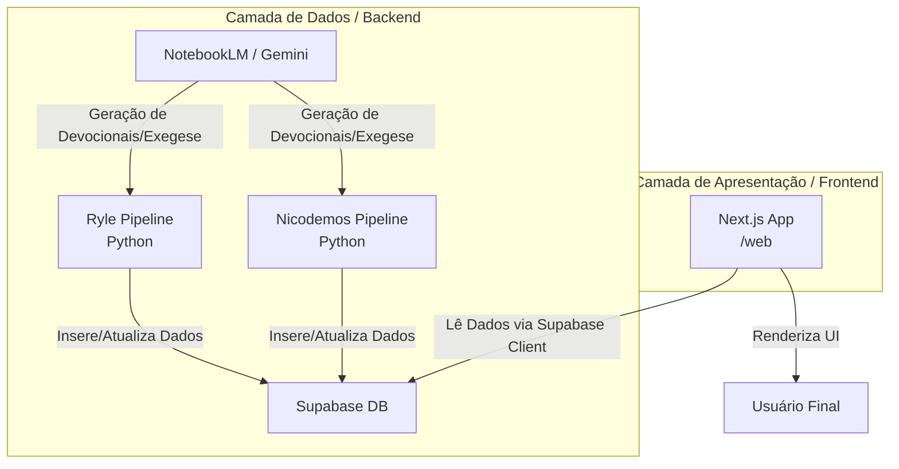

# Arquitetura do Trilha Graça Soberana

O projeto "Trilha Graça Soberana" possui duas grandes camadas: uma camada de backend focada em processamento massivo de conteúdo teológico usando LLMs (NotebookLM / Gemini) e um frontend moderno baseado em React e Next.js.

## Visão Geral

- **Geradores de Conteúdo (Python):** `ryle_pipeline` e `nicodemos_pipeline_100`. Responsáveis por capturar textos base (em PDF/arquivos) ou contextos teológicos pelo NotebookLM e criar Exegeses, Devocionais em rascunho, e gerar suas versões finais validadas e formatadas.
- **Armazenamento e Banco de Dados (Supabase PostgreSQL):** Tudo é sincronizado com um banco PostgreSQL usando o Supabase. As tabelas principais consistem num esquema public com RLS protegido.
- **Frontend / Client (Next.js):** Consome os dados gerados via requisições à API Supabase local. Desenvolvido com React, UI rica, estilização limpa.

## Diagrama da Arquitetura

## Diretórios Essenciais
- `/docs/`: Manuais e guias do repositório.
- `/scripts/`: Scripts úteis (em JS e Python) para refazer devocionais com bugs, revisar notas ou limpar formatações quebradas.
- `/logs/`: Arquivos `.txt` e `.log` gerados a partir do stdout das execuções em Background das pipelines.
- `/ryle_pipeline/` e `/nicodemos_pipeline_100/`: Agentes e pipelines executores focados no autor específico.
- `/web/`: Aplicação web para consumo do material gerado. 

## Segurança do Supabase
As tabelas no Supabase (`plano_devocional`, `exegeses`, `devocionais_final`, `nlm_cache`, etc) estão protegidas por Row Level Security (RLS). Para uso nos processos Python de automação do backend, as chaves `SUPABASE_SERVICE_ROLE_KEY` devem ser preferidas caso seja necessário forçar operações de inserção/deleção. Os acessos de Frontend estão limitados por Policies.
